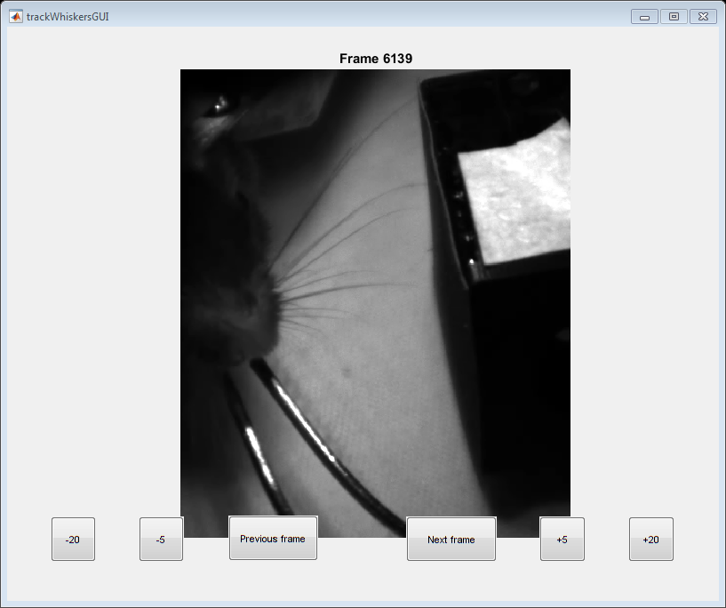

<div class="content">

# Get Neighboring Frames
###### Sacha McElligott || 09.09.2019 

## Initialization

<pre class="codeinput">close <span class="string">all</span>; clear <span class="string">all</span>; clc;
</pre>

## Select data to pull

<pre class="codeinput">pathRoot = <span class="string">'Z:\data\HS\avi\'</span>;
<span class="keyword">try</span>
    mouse = input(<span class="string">'Which mouse?: '</span>,<span class="string">'s'</span>);
<span class="keyword">catch</span> <span class="comment">% demo if input isn't given</span>
    mouse = <span class="string">'cb141'</span>;
<span class="keyword">end</span>
path = strcat(pathRoot,mouse);

files = dir(path);
alphabet = lower(<span class="string">'ABCDEFGHIJKLMNOPQRSTUVWXYZ'</span>);
<span class="keyword">for</span> i = 3:length(files)
    disp(<span class="string">' '</span>)
    disp(strcat(num2str(i-2),<span class="string">') '</span>,files(i).name));
    videoFiles = dir(strcat(path,<span class="string">'\'</span>,files(i).name,<span class="string">'\*.avi'</span>));
    <span class="keyword">for</span> j = 1:length(videoFiles)
        disp([<span class="string">'    '</span> alphabet(j) <span class="string">') '</span> videoFiles(j).name])
    <span class="keyword">end</span>
<span class="keyword">end</span>
<span class="keyword">try</span>
    n = input([<span class="string">'Which data would you like to analyze? (ex: 3b)'</span> newline <span class="string">'--> '</span>],<span class="string">'s'</span>);
<span class="keyword">catch</span> <span class="comment">% demo if input isn't given</span>
    n = <span class="string">'5b'</span>;
<span class="keyword">end</span>
</pre>

```
*OUTPUT*
1) 20171128
    a) 20171128_cb141_001.avi
    b) 20171128_cb141_002_mako_Start 2017-11-28 14.17.43.663.avi
    c) 20171128_cb141_003_mako_Start 2017-11-28 14.31.01.747.avi
    d) 20171128_cb141_004_mako_Start 2017-11-28 14.46.50.894.avi

2) 20171129
    a) 20171129_cb141_002_mako_Start 2017-11-29 21.43.20.331.avi
    b) 20171129_cb141_003_mako_Start 2017-11-29 21.57.23.710.avi
    c) 20171129_cb141_004_mako_Start 2017-11-29 22.10.53.851.avi
    d) 20171129_cb141_005_mako_Start 2017-11-29 22.23.47.465.avi
    e) 20171129_cb141_006_mako_Start 2017-11-29 22.37.06.031.avi
    f) 20171129_cb141_007_mako_Start 2017-11-29 22.50.45.790.avi
    g) 20171129_mako_Start 2017-11-29 21.29.52.662.avi

3) 20171130
    a) 20171130_cb141_001.avi
    b) 20171130_cb141_002_mako_Start 2017-11-30 15.12.16.470.avi
    c) 20171130_cb141_003_mako_Start 2017-11-30 15.25.50.531.avi
    d) 20171130_cb141_004_mako_Start 2017-11-30 15.39.36.028.avi
    e) 20171130_cb141_005_mako_Start 2017-11-30 15.54.29.333.avi

4) 20171204
    a) 20171204_cb141_001.avi
    b) 20171204_cb141_002_mako_Start 2017-12-04 16.40.13.159.avi
    c) 20171204_cb141_003_mako_Start 2017-12-04 16.53.32.189.avi
    d) 20171204_cb141_004_mako_Start 2017-12-04 17.59.16.813.avi
    e) 20171204_cb141_005_mako_Start 2017-12-04 17.19.24.514.avi
    f) 20171204_cb141_006_mako_Start 2017-12-04 17.32.53.508.avi
    g) 20171204_cb141_007_mako_Start 2017-12-04 17.46.15.230.avi
    h) 20171204_cb141_008_mako_Start 2017-12-04 17.59.16.813.avi

5) 20171208
    a) 20171208_cb141_001.avi
    b) **20171208_cb141_002_mako_Start 2017-12-08 14.30.14.884.avi**
    c) 20171208_cb141_003_mako_Start 2017-12-08 14.43.31.658.avi
    d) 20171208_cb141_004_mako_Start 2017-12-08 14.57.16.222.avi
    e) 20171208_cb141_005_mako_Start 2017-12-08 15.10.08.144.avi

6) 20171209
    a) 20171209_cb141_001.avi
    b) 20171209_cb141_003_mako_Start 2017-12-09 13.22.32.915.avi
    c) 20171209_cb141_005_mako_Start 2017-12-09 13.51.04.912.avi
    d) 20171209_cb141_006_mako_Start 2017-12-09 14.06.09.702.avi
    e) 20171209_cb141_007_mako_Start 2017-12-09 14.19.00.569.avi
    f) 20171209_cb141_008_mako_Start 2017-12-09 13.36.29.284.avi
    g) 20171209_cb141_009_mako_Start 2017-12-09 14.44.08.500.avi
```

## Pull data

<pre class="codeinput"><span class="keyword">if</span> length(n) > 2
    c = 1;
    dateID = str2num(n(1:2))+2;
<span class="keyword">else</span>
    c = 0;
    dateID = str2num(n(1))+2;
<span class="keyword">end</span>
<span class="keyword">for</span> i = 1:length(alphabet)
    <span class="keyword">if</span> strcmp(alphabet(i),n(c+2))
        videoID = i;
    <span class="keyword">end</span>
<span class="keyword">end</span>

videoFiles = dir(strcat(path,<span class="string">'\'</span>,files(dateID).name,<span class="string">'\*.avi'</span>));
<span class="keyword">global</span> obj;
obj = VideoReader(strcat(path,<span class="string">'\'</span>,files(dateID).name,<span class="string">'\'</span>,videoFiles(videoID).name));

numFrames = obj.Duration*obj.FrameRate;

<span class="keyword">global</span> frameID;
<span class="keyword">try</span>
    frameID = input([<span class="string">'Which frame number? (max = '</span> num2str(numFrames) <span class="string">'): '</span>]);
<span class="keyword">catch</span> <span class="comment">% demo if input isn't given</span>
    frameID = randi(numFrames);
<span class="keyword">end</span>
</pre>

## Display data

<pre class="codeinput">trackWhiskersGUI
</pre>

 [Published with MATLAB® R2016b](http://www.mathworks.com/products/matlab/)</div>
